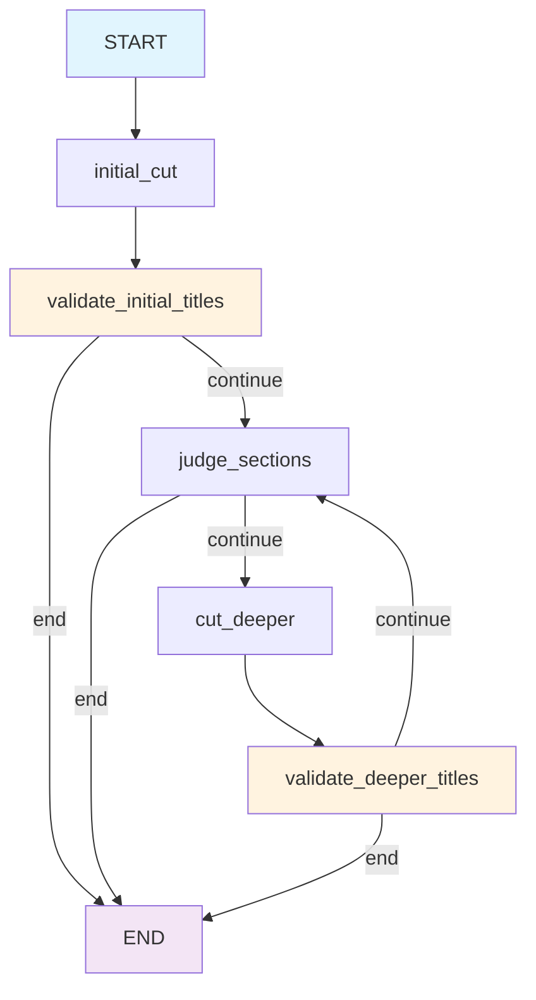

```mermaid
graph TD
    A["START"] --> B["initial_cut"]
    B --> C["validate_initial_titles"]
    C --> |"continue"| D["judge_sections"]
    C --> |"end"| E["END"]
    D --> |"continue"| F["cut_deeper"]
    D --> |"end"| E
    F --> G["validate_deeper_titles"]
    G --> |"continue"| D
    G --> |"end"| E
    
    style A fill:#e1f5fe
    style E fill:#f3e5f5
    style C fill:#fff3e0
    style G fill:#fff3e0
```